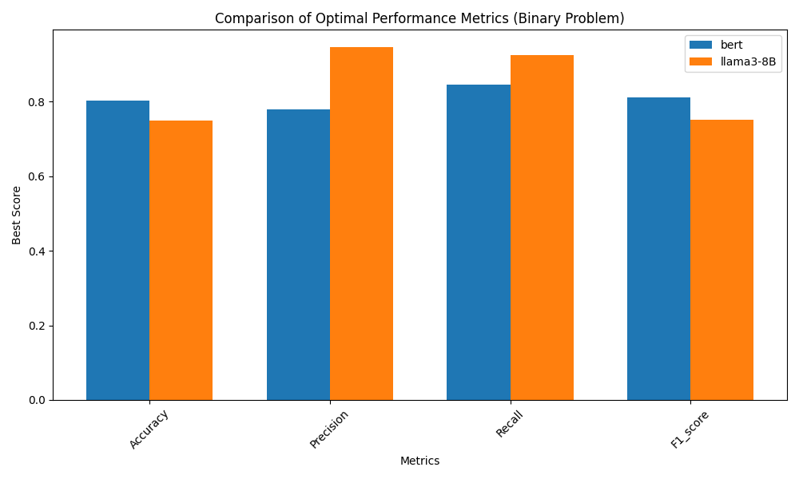
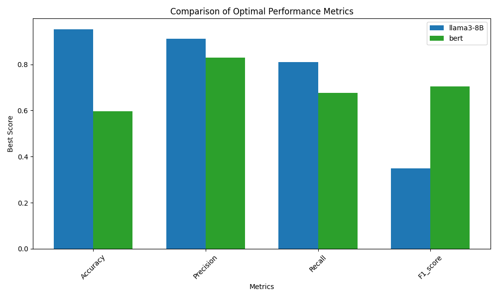

# Text Labelling: Zero-shot LLM vs Trad-ML

## Task

We have \~125k academic abstracts that need to be:


1. Categorised into being telecoms themed (Binary)
2. Labelled with one or more predefined telecoms labels (Multilabel)


For this dataset, we have only 522 labelled examples. Given this tiny amount of labelled data, traditional supervised learning methods are at a disadvantage. Because of this, I have compared the fine-tuning of BERT (a standard, high performing transformer-based ML model) with Llama3-8B (A high performing LLM for its size) to conduct the task in a zero-shot manner.


## Results

### Binary classification

 


### Multilabel classification

 

### LLM Plots

Interactive plots at the [repo page](https://hpfield.github.io/llama3-8B_vs_BERT__binary_and_multilabel_classification/)

## Problems
Within the CORDIS dataset, each academic abstract is stored with an associated list of topics (Fields of Science). These topics became our labels for the data, filtered by topics associated with the telecoms industry. 


These topics have a few issues, the most important of which are:
- Repetition: in the above example, we see a hierarchy of concepts ending in **5G**. Because of the way the topics were filtered, we also included telecommunications > telecommunications networks > mobile network  > **5G** in our possible labels, but only 5G is stored as a label for this example. This repetition of the same concept creates a noisy decision space for the models, especially the LLM which performs this task zero-shot.
- Missing context: The topics for each datapoint relate to the entire project, but we are attempting to obtain all the relevant information from the abstract alone. In many cases, the abstract does not contain enough information to properly label the datapoint.

## Repo Capabilities

This repo provides the tools to conduct the following tasks for both binary and multilabel classification using BERT and Llama3-8B:

* Create the classification dataset
* Train, run and evaluate ML method
* Run and evaluate zero-shot LLM-based classification
* Use ML and LLM methods to label the full dataset
* Compare the performance of each method

## Installation

To run the LLM components of this repo, you will need at least 16GB of Nvidia GPU memory. This repo has been tested on Ubuntu 22.04 using python 3.8.


```
conda env create -f environment.yml
conda activate llama_vs_bert
```


### Installing Llama3-8B

Follow the instructions at the [Llama 3 git repo](https://github.com/meta-llama/llama3) to install the model. This may involve toggling the versions of pytroch and cuda to suit your hardware. Once installed, copy the `Meta-Llama-3-8B-Instruct` folder into the root directory of this repo.

## Downloading data

Install git lfs to handle large files in the repo with:
```
sudo apt update
sudo apt install git-lfs
```

Initialise git lfs and track csv files:
```
git lfs install
git lfs track "*.csv"
```

Pull the large files (may take a while):
```
git lfs pull
```


## Clean Data

Processes the raw data into suitable datasets for binary classification and multilabel downstream tasks.

The `create_full_binary` parameter cleans the entire \~150k samples for later inference. Set to `False` if only interested in model training and evaluation.


```
cd preprocessing
python process_raw.py create_full_binary=True
```


## Binary Classification


```javascript
cd binary
```


View the README in the `binary` directory for further instruction.


## Multilabel Classification

Multilabel classification approaches can be trained and evaluated without having completed the Binary classification component. However, to perform multilabel classification on the full dataset, Binary classification must have been completed so that only telecoms data is considered.


```javascript
cd multilabel
```

View the README in the `multilabel` directory for further instruction.