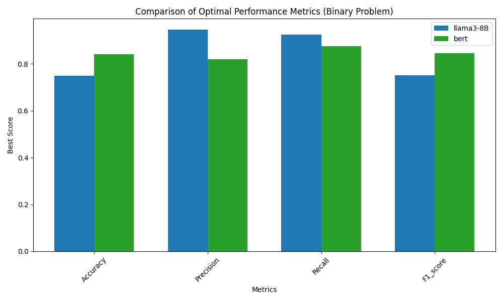

# Text Labelling: Zero-shot LLM vs Trad-ML

## Task

We have \~125k academic abstracts that need to be:


1. Categorised into being telecoms themed (Binary)
2. Labelled with one or more predefined telecoms labels (Multilabel)


For this dataset, we have only 522 labelled examples. Given this tiny amount of labelled data, traditional supervised learning methods are at a disadvantage. Because of this, I have compared the fine-tuning of BERT (a standard, high performing transformer-based ML model) with Llama3-8B (A high performing LLM for its size) to conduct the task in a zero-shot manner.


## Results

### Binary classification

 


### Multilabel classification

 

#### LLM Plots
Interactive plots at the [repo page](https://hpfield.github.io/llama3-8B_vs_BERT__binary_and_multilabel_classification/)

## Repo Capabilities

This repo provides the tools to conduct the following tasks for both binary and multilabel classification using BERT and Llama3-8B:

* Create the classification dataset
* Train, run and evaluate ML method
* Run and evaluate zero-shot LLM-based classification
* Use ML and LLM methods to label the full dataset
* Compare the performance of each method

## Installation

To run the LLM components of this repo, you will need at least 16GB of Nvidia GPU memory. This repo has been tested on Ubuntu 22.04 using python 3.8.


```
conda env create -f environment.yml
conda activate llama_vs_bert
```


### Installing Llama3-8B

Follow the instructions at the [Llama 3 git repo](https://github.com/meta-llama/llama3) to install the model. This may involve toggling the versions of pytroch and cuda to suit your hardware. Once installed, copy the `Meta-Llama-3-8B-Instruct` folder into the root directory of this repo.


## Downloading Data

Data is stored on google drive.


```
mkdir raw_data
cd raw_data
```


Go to the [google drive file location](https://drive.google.com/file/d/1YRW6CTs1Pc6gfmzVNST0oP-uP5bqKOXv/view?usp=drive_link) and download the csv into raw_data.

## Clean Data

Processes the raw data into suitable datasets for binary classification and multilabel downstream tasks.

The `create_full_binary` parameter cleans the entire \~150k samples for later inference. Set to `False` if only interested in model training and evaluation.


```
cd preprocessing
python process_raw.py create_full_binary=True
```


## Binary Classification


```javascript
cd binary
```


View the README in the `binary` directory for further instruction.


## Multilabel Classification

Multilabel classification approaches can be trained and evaluated without having completed the Binary classification component. However, to perform multilabel classification on the full dataset, Binary classification must have been completed so that only telecoms data is considered.


```javascript
cd multilabel
```

View the README in the `multilabel` directory for further instruction.
